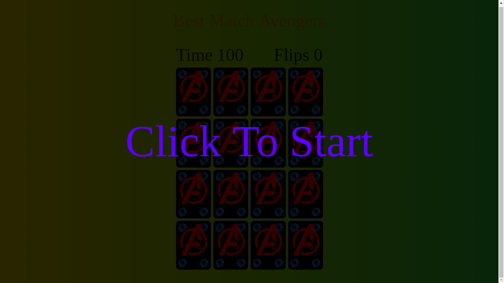
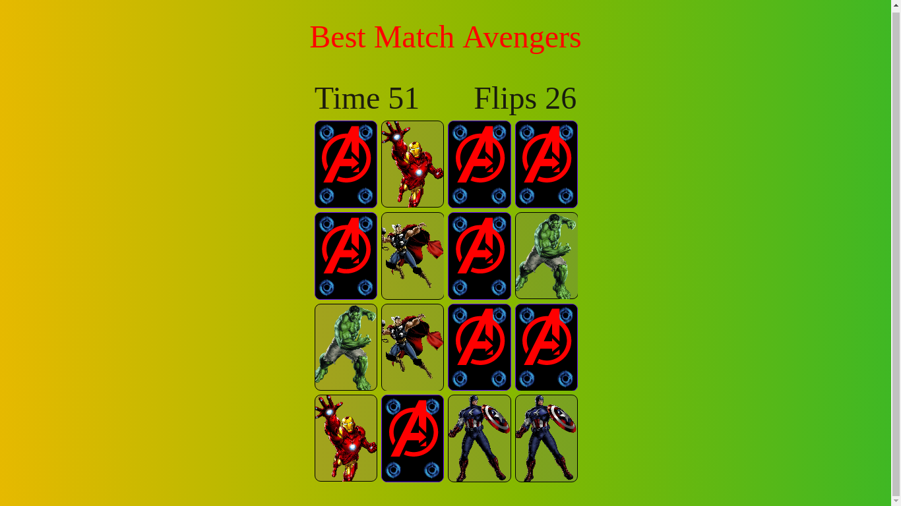
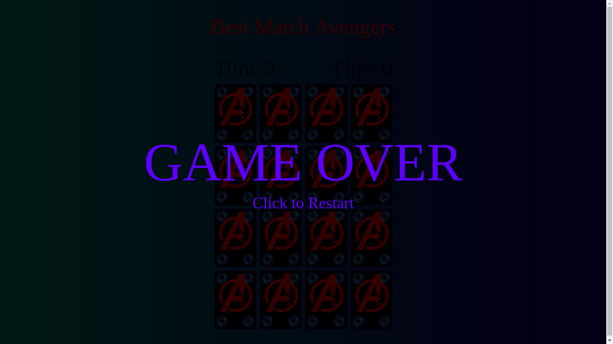

# BeshMatch Memori Game
## introduction
this game is my very first project using javascript DOM, I make this game in 1 week jush a simple card memory game.

## Preview
### Start screen.

### How playing this game look like

### Game over

## What am I using?
- javascript DOM
- CSS
- HTML 5

## how to play?
you can play it in your web browser jush click random card and find the same image

